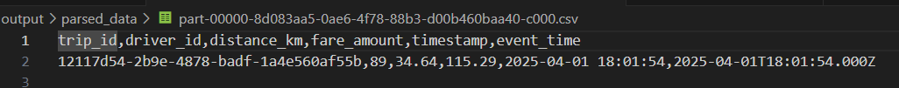
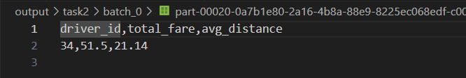
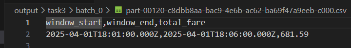

# Ride-sharing-spark-streaming
Spark structured streaming example

# Prerequisites
Before starting the assignment, ensure you have the following software installed and properly configured on your machine:

1. Python 3.x:

Verify installation:

``` 
python3 --version 

```

2. PySpark:
Install using pip:
```
pip install pyspark

```

3. Apache Spark:

Ensure Spark is installed. You can download it from the Apache Spark Downloads page.
Verify installation by running:
```
spark-submit --version

```

## Project Structure
Ensure your project directory follows the structure below:
```

ride-sharing-analytics-spark-streaming/
├── chk/
│   ├── commits
│   └── offsets
├── outputs/
│   ├── parsed_data
│   ├── task2
│   ├── task3
├── src/
│   ├── task1_streaming_ingestion.py
│   ├── task2_streaming_ingestion.py
│   ├── task3_streaming_ingestion.py
├── data_generator.py
└── README.md

```

##  Running the Analysis Tasks
You can run the analysis tasks either locally or using Docker.

### Running Locally
  
1. Navigate to the Project Directory:

2. Execute Each Task Using spark-submit:
```
  spark-submit task1_streaming_ingestion.py
  spark-submit task2_streaming_ingestion.py
  spark-submit task3_streaming_ingestion.py
 ```
  
3. Verify the Outputs: Check the outputs/ directory for the resulting files:
```

ls outputs/

```

### Running with Docker (Optional)
1. Start the Spark Cluster:
```
docker-compose up -d
```
2. Access the Spark Master Container:
```
docker exec -it spark-master bash
```
3. Navigate to the Spark Directory:
```
cd /opt/bitnami/spark/
```
4. Run Your PySpark Scripts Using spark-submit:
```
spark-submit task1_streaming_ingestion.py
spark-submit task2_streaming_ingestion.py
spark-submit task3_streaming_ingestion.py

```
5. Exit the Container
```
exit
```
Verify the Outputs: On your host machine, check the outputs/ directory for the resulting files.

6. Stop the Spark Cluster
```
docker-compose down
```

# 🎯Objective

This project aims to build a real-time analytics pipeline for a ride-sharing platform using Apache Spark Structured Streaming. It simulates continuous data flow from ride events and ingests them from a socket. The project parses JSON ride data into structured format for processing. It performs real-time aggregations on driver earnings and trip distances. Additionally, it analyzes time-based trends using sliding window functions for dynamic insights.

# Task 1

1. **Create Spark Session**: Initialize a SparkSession with Structured Streaming support.  
2. **Read Stream from Socket**: Use `spark.readStream.format("socket")` to connect to `localhost:9999`.  
3. **Read Raw Data**: Stream incoming text lines where each line is a JSON string representing a ride event.  
4. **Define Schema**: Create a schema for parsing JSON fields like `trip_id`, `driver_id`, `distance_km`, `fare_amount`, and `timestamp`.  
5. **Parse JSON**: Use `from_json()` to parse the raw text data into structured columns.  
6. **Select Columns**: Extract individual fields from the parsed JSON into a clean DataFrame.  
7. **Write to Console**: Output the parsed streaming DataFrame to the console using `.writeStream.format("console")`.  
8. **Start the Stream**: Trigger the streaming query with `.start().awaitTermination()` to keep it running.


### Sample Output



# Task 2

1. **Reuse Parsed Data**: Use the cleaned DataFrame from Task 1 which contains structured ride data.  
2. **Group By Driver**: Apply `groupBy("driver_id")` to calculate metrics per driver.  
3. **Aggregate Fare**: Use `sum("fare_amount")` to calculate each driver’s total earnings.  
4. **Average Distance**: Use `avg("distance_km")` to find the mean distance driven per driver.  
5. **Rename Columns**: Rename results to `total_fare` and `avg_distance` for clarity.  
6. **Write to Console**: Output real-time aggregated results to the console for quick viewing.  
7. **Write to CSV**: Add `.writeStream.format("csv")` with an output path to save results.  
8. **Start Stream**: Use `.outputMode("complete")` and start the query to keep it running.

### Sample Output



# Task 3

1. **Convert Timestamp**: Cast the `timestamp` string column to `TimestampType` using `to_timestamp()`.  
2. **Create Event Time Column**: Add a new column `event_time` to hold the converted timestamp.  
3. **Apply Window Function**: Use `window("event_time", "5 minutes", "1 minute")` for sliding window analysis.  
4. **Group by Window**: Group data by the window to perform time-based aggregations.  
5. **Aggregate Fare**: Use `sum("fare_amount")` to compute total fare per time window.  
6. **Select Output Columns**: Choose fields like `window.start`, `window.end`, and `total_fare`.  
7. **Write to CSV**: Output the aggregated windowed results to a specified CSV path.  
8. **Start Stream**: Start the streaming query and keep it running with `.start().awaitTermination()`.

### Sample Output



